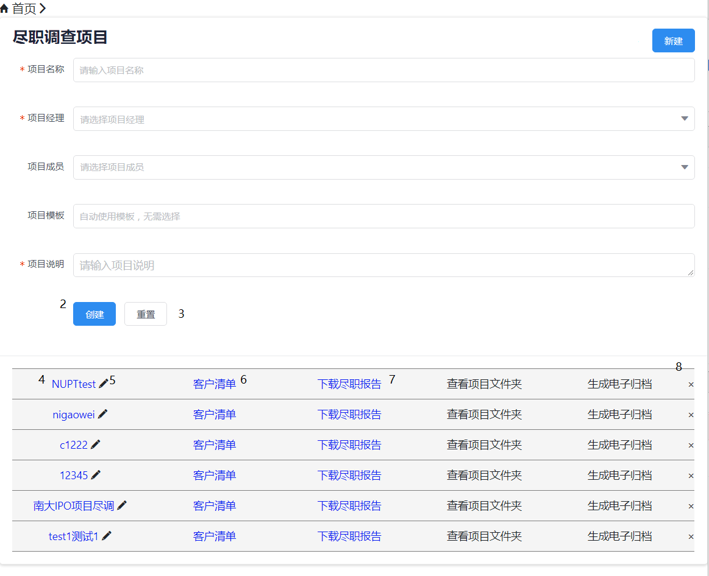
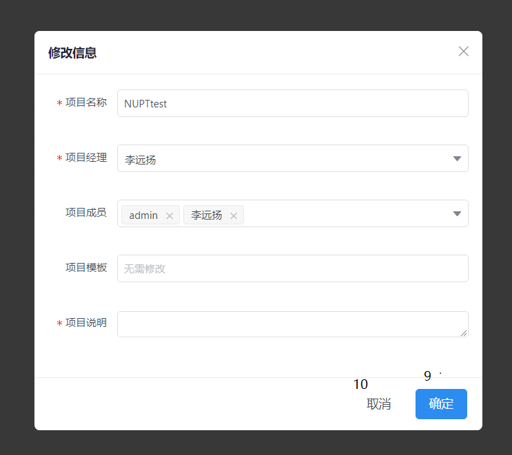
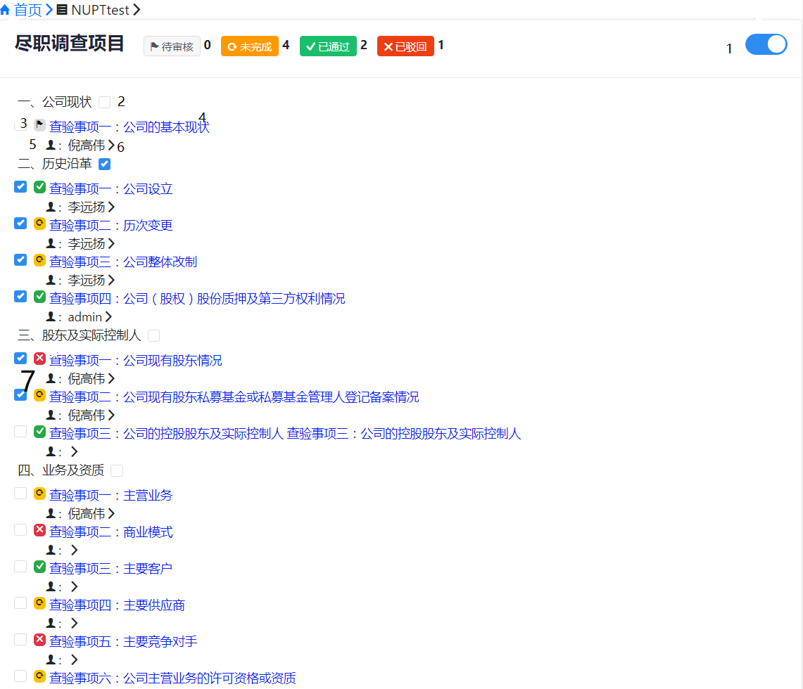

# nawcube   
> gradle用法
>> 方法一：
进入项目文件夹的根目录下，在命令行输入：  gradle bootRun   
>> 方法二：
进入项目文件夹的根目录下，在命令行输入：  gradle build  
然后会在项目文件夹中的buildbs文件下生成一个jar（名称和启动类名称一样），用java来运行: java -jar xxxx.war   

> 查看API
>> javadoc ??

## API命名规则 : API_页面简称_接口序号_send or receive data 添加的新内容标志 [new]()
* [API整体预览]()   
    * [登录接口](#login)   
        * 接口数量：？ ？
    * [权限接口](#roleId) 
        * 接口数量：1 新：?
    * [页面导航接口](#router)
        * 接口数量：1 
    * [页面1](#page1)  
        * 接口数量：6
    * [页面2](#page2)  
        * 接口数量：5

<h3 id="login">登陆接口</h3>

### API_r :根据所获取的用户信息，对用户进行登陆验证    
> request path :logi    
> receive sample :
>```json
{
    "email":"123",
    "password":"456"
}
>```

> return sample : [new]()   
>```yaml
cookie:
    tooken:""
    username:""
body:
    0：正确  
    1：用户名错误
    2：密码错误
>```

<h3 id="roleId">权限接口</h3>

> 选中对应接口 按Ctrl+F查找接口
> 权限id的意义 1：项目经理 2：成员用户 3 ：一般用户
> 涉及到的接口有：
>```yaml
API_1_3
API_1_6
API_2_2
API_2_3
API_2_4
API_2_5
>```

<h3 id="router">页面导航接口</h3>

> 目前只有两个页面导航接口
>```yaml
API_2_8
>```

<h3 id="page1">页面1</h3>  


## 1 隐藏接口
### API_1_1_s : 发送项目的基本信息内容(具体看表project，user)   返回所有项目的id（long），name，template    
> request path : API/projects     
> return sample :  
>```json
{
    "projects":[
        {
            "id":"",
            "name":"",
            "charge":"",
            "members":[
                "",
                ""
            ],
            "description":"",
            "template":""
        },
    ] 
    "members":[
		"",
	]
}  
>```

## 2  no 3
### API_1_4_r :创建新的项目     
>request path :  API/createProject   
>receive sample :
>```json
{
    name : "xxxx",
    description : "xxxx",
    charge : "xxxx",
    members : [
            "xxxx",
            "xxxx",
            //   .....
            ]
 }
>```

## 4 跳转到第二个页面 接API_2_1
## 5 
### API_1_2_s :发送单个项目的基本信息内容用于显示     
> request path :API/project/{projectId} (projects/id)   
> return sample :
>```json
{
    "id":0,//对应后面的projectId，项目id
    "name":"c21p",
    "charge":"admin",
    "members":[
        "admin",
        "nigaowei"
    ],
    "description":"oK!",
    "template":"策问技术"
}   
>```

## 6 ？？？？
## 7
### API_1_5_r:创建并下载尽职报告(文档格式需要有些调整)
> request path : API/createFinal/{projectId}  
> 页面重定向到下载页面，无需其他返回，对应的后台操作就是当我访问这个页面的时候你告诉前端现在你要下载这个文件

## 8
### API_1_6_r:删除项目
> request path :API/deleteProject/{projectId}   
> no receive   
> return sample :
>```yaml
body
    !1 前端提示你不是该项目管理员，无权操作
>```

## 9
### API_1_3_r :从前端获取更新的某个项目的基本信息      
> request path :API/updateProject/{projectId}     
> receive sample :
>```json
{
    name : "xxxx",
    description : "xxxx",
    charge : "xxxx",
    members : [
        "xxxx",
        "xxxx",
        //   .....
    ]
} 
>```

> return sample: [new]()   
>```yaml
body
    !1 前端提示你不是该项目管理员，无权操作
>```


<h3 id="page2">页面2</h3> 


## 0 隐藏接口 
### API_2_1_s :  得到展示内容 
> request path :API/get/{name}   
> return :
>```json
{
    "unfinished":17,//空
    "review":12,//待审核
    "turn":18,//驳回
    "finish":14,//通过
    "usernames":[
        {
            "name":"test3"
        },
    ],
    "detail":[
        {
            "name":"test5",
            "first":[
                {
                    "checkItem":"test6",
                    "dueDiligence":"test7",
                    "status":"?",//success通过.warning空.error待审核.danger驳回
                    "flag":"?",//1.0
                    "num":"1-1",
                    "projectId":0,//API_1_1.id
                    "statusReason":"test8",
                    "username":"usernames.name"
                },
            ]
        },
    ]
} 
>```

## 1
### API_2_5_s:根据projectId获取projectName，用于导航栏的显示
>request path:API/getProjectName/{projectId}    
>return sample :    
>```yaml
bady:
    NUPT123
cookie:
    roleId:!1
>```

## 2/3                                 
### API_2_2_r :查验大项dueDiligence的勾选(例如：二、历史沿革)
> request path :API/updateFlags/{projectId}  
> receive sample :
>```
{
    dueDiligence:"二、历史沿革",
    flag:"0"    //0:表示取消勾选，1:表示勾选
}
>```

>return : 
>``` yaml   
body:
    !1
>```

### API_2_3_r :查验内容的勾选(查验小项checkItem)
>request path :API/updateStatus/{projectId}  
>receive : 
>```  
{
    num:"1-1",
    flag:"0"   //0:表示取消勾选，1:表示勾选
}
>```

>return : 
>``` yaml   
body:
    !1
>```

## 4 跳转到第二个页面 接API_3_1
## 5 
### API_2_4_r :执行者的选择    
>request path :API/updateUser       
>receive sample  :
>```
{
    "num":"1-1",
    "projectId":0,
    "username":"nigaowei" 
} 
>```
  
>return : 
>``` yaml   
body:
    !1
>```


### API_3_1_r : 
>request path :API/getThird/{projectId}/{numId} (projectId为查看的项目Id，numId为所查看的二级编号)      
>return sample:   


```
[
	{
		"num":"1-1-1",
		"checkWay":"test",
		"draftRequirements":"test",
		"guidance":"test",
        "thirdLists":[
			{
				"checkContent":"test",
				"checkResult":"success",
				"checkConclusion":"test",
				"id":192,
				"checkNumId":1
			},
			//Others
		],
		"basicConclusion":"test",
		"reviewConfirmationOpinions":"test",
        "forths":[
			{
				"factualMaterial":"test",
				"files":[
					{
						"filename":"test",
						"path":"D:\\chu\\1",
						"forthId":0
					},
					//Others
				],
				"id":1,
				"thirdId":0
			},
            //Others
		],
		"projectId":0,
	},
    Others
]
```


### API_3_2_r :[new]()更新三级菜单内容，出来确认复核意见(只有查验该项目的执行者才有权限)            
>request path :API/updateThirdList  
>receive sample :


```
//此数据仅仅用于projectId为38的1-1-1
{
		"basicConclusion":"多吃点吃的",
		"num":"1-1-1",
		"projectId":38,
		"reviewConfirmationOpinions":"带点吃的",
		"thirdLists":[
			{
				"checkConclusion":"对对对",
				"checkContent":"获取公司基本信息，包括但不限于：统一社会信用代码/注册号、企业类型、法定代表人、注册资本、住所、经营期限、经营范围",
				"checkResult":"success",
				"id":192,
				"num":"1-1-1",
				"projectId":38,
			},
			{
				"checkConclusion":"",
				"checkContent":"公司的经营状态是否正常：是否被列为经营异常名录、是否被列为严重违法企业名单等",
				"checkResult":"success",
				"id":193,
				"num":"1-1-1",
				"projectId":38,
				
			},
			{
				"checkConclusion":"",
				"checkContent":"将营业执照记载事项逐一与章程、批文、股东会决议等对照，确认是否一致",
				"checkResult":"success",
				"id":194,
				"num":"1-1-1",
				"projectId":38,
				
			},
			{
				"checkConclusion":"",
				"checkContent":"营业执照记载事项是否与实际情况一致（例如注册地与经营地不一致）",
				"checkResult":"success",
				"id":195,
				"num":"1-1-1",
				"projectId":38,
				
			}
		]
	}
```
>return sample:
    
    1.如果有权限，则执行，且有200的状态码
    2.如果无权限，则不执行，并且发送数据 0，以及200的状态码
    
### API_3_2_r_test:[new]() (默认的登陆的是李远扬，)  
>request path :API/TestupdateThirdList 
>receive sample : 同上
>return sample:
    
    1.如果有权限，则执行，且有200的状态码
    2.如果无权限，则不执行，并且发送数据 0，以及200的状态码

### API_3_3_r : 通过请求   
>request path :API/submit   
>receive sample :


    {
        "projectId":0,
        "num":"1-1" //对应这发送数据里的numId
    }
    

### API_3_4_r : 驳回请求以及驳回原因    
>request path :API/rebut   
>receive sample :


    {
        "projectId":0,
        "num":"1-1", //对应这发送数据里的numId
        "statusReason":""//驳回原因
     }


### API_3_5_s : 提供该用户在该项目中的权限    
>request path :API/permission/{projectId}    
>return sample :

```
    {
        roleId : 1  //1:表示是项目经理可以驳回，2：表示成员用户 
    }

```

### API_3_5_s_test :[new]() 提供该用户在该项目中的权限(与token无关,无需登陆，默认的是 李远扬 作为当前用户)     
>request path :API/permission/{projectId}    
>return sample :


    {
        roleId : 1  //1:表示是项目经理可以驳回，2：表示成员用户 
    }

    
### API_3_6_r : 提示管理需要进行审核,状态为待审核       
>request path :API/submit_review         
>receive sample :    

    {
        "projectId":0,
        "num":"1-1" //对应这发送数据里的numId
    }
    

### API_3_7_r:保存第三页面的所有修改内容(除了文件外) //暂时没有加权限
>request path:API/review    
>receive sample :
    
    [
      {
      		"basicConclusion":"测试一波",
      		"checkWay":"书面确认",
      		"draftRequirements":"复印件",
      		"guidance":"细心、认真",
      		"num":"1-1-1",
      		"numId":"1-1",
      		"projectId":38,
      		"reviewConfirmationOpinions":"test1Ok!",
      		"thirdLists":[
      			{
      				"checkConclusion":"大问题",
      				"checkResult":"error",
      				"id":192,
      				"num":"1-1-1",
      				"projectId":38
      			},
      			{
      				"checkConclusion":"",
      				"checkResult":"success",
      				"id":193,
      				"num":"1-1-1",
      				"projectId":38
      			},
      			{
      				"checkConclusion":"",
      				"checkResult":"success",
      				"id":194,
      				"num":"1-1-1",
      				"projectId":38
      			},
      			{
      				"checkConclusion":"",
      				"checkResult":"success",
      				"id":195,
      				"num":"1-1-1",
      				"projectId":38
      			}
      		]
      	},
      	
      	{
      	//others
      	}
      	...
    ]

>return ：返回200的状态码


### API_3_8_r :[new]()提交复核意见reviewConfirmationOpinions 
>request path :API/submitReviewConfirmation
>receive sample:
    
    {
        projectId : 38,
        num : "1-1-1",
        reviewConfirmationOpinions:"xxxxx"  //具体内容
    }
    
>return sample:
    
    1.如果roleId = 1(项目经理),则有200的状态码，无数据返回，
    2.如果roleId != 1 (非项目经理,首先页面无 "确认复核意见" 这一项,)则有200 的状态码,返回数据 0    

### API_3_8_r_test :[new]()提交复核意见reviewConfirmationOpinions(与token无关,无需登陆，默认的是 李远扬 作为当前用户)
>request path :API/submitReviewConfirmation
>receive sample:
    
    {
        projectId : 38,
        num : "1-1-1",
        reviewConfirmationOpinions:"xxxxx"  //具体内容
    }
    
>return sample:
    
    1.如果roleId = 1(项目经理),则有200的状态码，无数据返回，
    2.如果roleId != 1 (非项目经理,首先页面无 "确认复核意见" 这一项,)则有200 的状态码,返回数据 0    


### API_3_9_r：[new]()删除上传文件
>request path :API/deletefile
>receive sample :

    {
        "fileName":"xxxx",  //具体的文件名
        "projectId":19,
        
        //下面这个是新增加的
        "forthId":"1-1-1-1" //见localhost:8080/API/getThird/38/1-1  中files对象里的forthId
    }
    
>返回200的状态


>上传
>>request path :API/uploadFile      
需要你传来的参数有：projectId(见localhost:8080/API/getThird/38/1-1 中非forths体的projectId)     num(num为相应的四级菜单的标号，1-1-1-1)


### API：删除上传文件
>request path :API/deletefile
>receive sample :

    {
        "fileName":"xxxx",  //具体的文件名
        "projectId":19
    }
    
>返回200的状态


## 下面这两个在首页的绑定，你需要调换下
### API:下载尽职报告
>request path :API/createFinal/{projectId}
>返回200的状态

### API:客户清单
>request path :API/list/{projectId}
>返回200的状态


>下载
>>request path :API/download
>receive sample :

    {
        "fileName":"xxxx",   具体文件名称  
        "projectId":19
    }
>如果需要返回状态码，说下，如果不清楚，也说下


### 新增API_2:点击第二页的查验大项（dueDiligence）（例如：二、历史沿革），会将下面的查验小项（checkItem）全都勾中或者取消勾选   
>request path:API/updateFlags/{projectId}   
>receive sample:


    {
         flag:0,//flag：1，则表示勾选，flag：0，表示取消勾选
         dueDiligence:"二、历史沿革"
    }
    

    
### 新增API_3:提供登陆者的名字，将与其对应的执行者名字显示为高亮或者加深(能凸显出来就行，形式随便)
>request path:API/provideUserName   
>return sample:

    李永//在用李永的账号的登陆是显示这个


### 新增权限控制(目前仅有权限(roleId)为1的可以执行下列操作，其他都是给提示：无该权限) (获取roleId的请求是API/permission/{projectId}，之前写的 API_3_5_s)
>1 修改执行者 API/updateUser   
>2 查验事项的勾选:勾选一项 API/updateStatus/{projectId}    
>3 查验事项的勾选:一次性勾选多个 API/updateFlags/{dueDiligence}   
>以上请求中，若有权限，则会执行该操作，并且返回200的状态码，无数据返回，若无权限，则不执行，并返回200的状态码，以及数据 0 以示无权限(测试时需要重新登陆)

### 新增API_4:保存第三页面的所有修改内容(除了文件外)
>request path:API/review    
>receive sample :
    
    [
      {
      		"basicConclusion":"测试一波",
      		"checkWay":"书面确认",
      		"draftRequirements":"复印件",
      		"guidance":"细心、认真",
      		"num":"1-1-1",
      		"numId":"1-1",
      		"projectId":38,
      		"reviewConfirmationOpinions":"test1Ok!",
      		"thirdLists":[
      			{
      				"checkConclusion":"大问题",
      				"checkResult":"error",
      				"id":192,
      				"num":"1-1-1",
      				"projectId":38
      			},
      			{
      				"checkConclusion":"",
      				"checkResult":"success",
      				"id":193,
      				"num":"1-1-1",
      				"projectId":38
      			},
      			{
      				"checkConclusion":"",
      				"checkResult":"success",
      				"id":194,
      				"num":"1-1-1",
      				"projectId":38
      			},
      			{
      				"checkConclusion":"",
      				"checkResult":"success",
      				"id":195,
      				"num":"1-1-1",
      				"projectId":38
      			}
      		]
      	},
      	
      	{
      	//others
      	}
      	...
    ]

>返回200的状态码